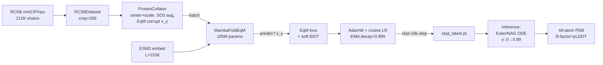

# MambaFold — Documentation

Mamba-3 기반 단백질 구조 예측 모델. SimpleFold 레시피(crop=256 pretrain, EqM objective, ESM3 conditioning) 위에 Mamba-3 bidirectional SSM trunk를 얹어 **O(L) 메모리**로 긴 시퀀스 학습 가능.

## 구현 문서

| 파일 | 내용 |
|------|------|
| [architecture.md](architecture.md) | 모델 구조 (atom enc/dec, residue trunk, BiMamba3) |
| [data_pipeline.md](data_pipeline.md) | 원본 PDB → npz → ESM → ProteinBatch |
| [training.md](training.md) | EqM loss, DDP, AMP, OOM recovery |
| [inference.md](inference.md) | Euler/NAG ODE 샘플링, RMSD/lDDT 평가 |

## 논문 레퍼런스

`papers/`에 설계에 참고한 논문 PDF 및 요약:

1. **[OVERVIEW.md](papers/OVERVIEW.md)** — 세 논문이 MambaFold 설계에 어떻게 매핑되는지
2. **[simplefold_summary.md](papers/simplefold_summary.md)** — 아키텍처 reference (atom enc → trunk → atom dec)
3. **[mamba3_summary.md](papers/mamba3_summary.md)** — residue trunk backbone
4. **[equilibrium_matching_summary.md](papers/equilibrium_matching_summary.md)** — EqM training objective

## 한눈에 보는 파이프라인



## 현재 상태 (2026-04)

- **Pretrain**: crop=256, step 450k/1M, batch 8 × copies 4 (H100 80GB 단일 GPU)
- **Plateau 시작**: step 250k 이후 loss ~3.0, lDDT loss 0.34 고정 → crop=256 한계

### 검증된 성능 (step 450k, ckpt_26367, EMA + ESM3-open)

| PDB | L | 타입 | Cα RMSD | lDDT | 등급 |
|---|---|---|---|---|---|
| 1eid | 124 | 학습세트 | 0.98 Å | 0.86 | ✅ AF2급 |
| 10AF | 179 (core 170) | 신규 | **0.81 Å** | 0.89 | ✅ AF2급 |
| 7uvm | 221 | 학습세트 | 1.42 Å | 0.82 | ✅ 우수 |
| 5lfl | 202 | 학습세트 | 1.85 Å | 0.75 | ✅ 양호 |
| 9IQM | 121 | 신규 | 2.52 Å | 0.66 | 🟡 대략 맞음 |
| 8ki5 | 332 | 학습세트 | 2.21 Å | 0.70 | 🟡 양호 |
| 1h6b | 433 | 학습세트 | 7.85 Å | 0.53 | 🟠 저하 |
| 7l7s | 524 | 학습세트 | 11.3 Å | 0.36 | 🔴 실패 |
| 9KQV | 423 (core 366) | 신규 | 24.8 Å | 0.13 | 🔴 실패 |
| 7n4x | 1024 | 학습세트 | 22.5 Å | 0.22 | 🔴 실패 |

**경계선**: L ≤ 256 (crop 크기)에서 우수 → L > 400에서 급속 저하 → **finetune (crop=512) 필요**.

### 폴딩 속도 (A5000)

| L | 전체 (ESM + ckpt 로드 + 6 samples) | 단일 50-step ODE |
|---|---|---|
| ≤ 150 | ~1–2 min | ~5–8 s |
| 200–400 | ~2–3 min | ~10–15 s |
| 500–1000 | ~3–5 min | ~20–30 s |

H100 기준 대략 1.5–2배 빠름. 상세는 [inference.md](inference.md) 참조.

## 빠른 시작

```bash
# 1. H100 단일 GPU 학습 재개 (DDP 이슈 회피)
RESUME=outputs/train/26367/ckpt_latest.pt sbatch scripts/slurm/train_h100.sh

# 2. 학습 세트 sanity check (all-atom PDB + per-atom pLDDT in B-factor)
OUT=outputs/infer_train/run1 sbatch scripts/slurm/infer_train.sh

# 3. 임의 시퀀스 inference (ESM 자동 계산)
sbatch scripts/slurm/infer_2025.sh 10AF "MAHHHHHHMSRPHVFFDITI..."
```
