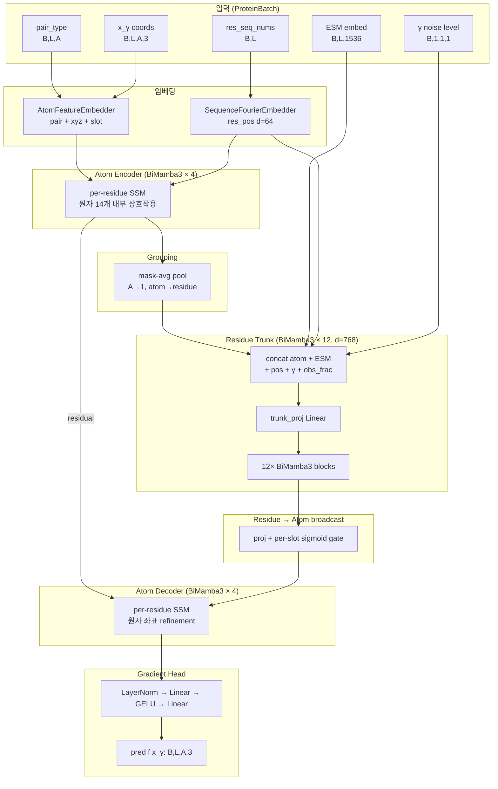

# 모델 아키텍처

`src/mambafold/model/mambafold.py` · `MambaFoldEqM` (기본 **185.3M params**).

## 설계 철학

SimpleFold-style 3-stage pipeline:

1. **Atom encoder** — 각 residue 내 원자들끼리 정보 교환 (local)
2. **Residue trunk** — residue 수준 시퀀스 모델링 (global, 모델 capacity의 주력)
3. **Atom decoder** — trunk output을 atom 공간으로 다시 broadcast해 gradient 예측

SimpleFold 대비 차이점:
- Transformer trunk → **Mamba-3 bidirectional (BiMamba3)**
- 시퀀스 길이 대비 **O(L) 메모리**, 긴 단백질 학습에 유리
- ESM3 embedding을 trunk 입력에 concat (SimpleFold와 동일)

## 전체 블록 다이어그램



## 단계별 상세

### 1. Atom embedding + encoder

```python
atom0 = self.atom_embed(batch.pair_type, batch.x_gamma, batch.atom_mask, res_pos)
# [B, L, A, d_atom=384]  pair+xyz+slot+pos_bcast concatenated

atom = self.atom_encoder(
    atom0.reshape(B*L, A, -1),   # 각 residue를 독립 sequence로
    batch.atom_mask.reshape(B*L, A)
).reshape(B, L, A, -1)
```

- `AtomFeatureEmbedder`: pair(residue,atom) 임베딩 + 노이즈 좌표 linear + per-slot learnable + (선택) residue-pos fourier 모두 concat
- `atom_encoder`: **4-layer BiMamba3 stack, d_state=64, headdim=64**, 각 residue 내 원자 sequence 모델링 (길이 A=15)

### 2. Grouping — atom → residue

```python
def group_atoms_to_residues(atom_tok, atom_mask):
    mask_f = atom_mask.unsqueeze(-1).to(atom_tok.dtype)
    return (atom_tok * mask_f).sum(dim=2) / mask_f.sum(dim=2).clamp(min=1)
# [B, L, d_atom]  masked mean over A
```

### 3. Residue trunk

Trunk 입력은 5가지 feature concat:

| feature | shape | 설명 |
|---|---|---|
| `res0` (atom→res) | B, L, 384 | Grouping 결과 |
| `obs_frac` | B, L, 1 | 관측된 원자 비율 |
| `gamma_feat` | B, L, 1 | 노이즈 레벨 broadcast |
| `res_pos` (optional) | B, L, 64 | Fourier positional embed |
| `plm` (ESM) | B, L, 1536 | ESM3-open embedding |

→ `trunk_proj Linear` → `d_res=768`
→ **12-layer BiMamba3 stack, d_state=64, headdim=64, expand=2, mimo_rank=4**

BiMamba3는 순방향 + 역방향 Mamba-3 블록을 병렬 실행해 bidirectional context를 얻음.

### 4. Residue → Atom broadcast

```python
class ResidueToAtomBroadcast(nn.Module):
    def forward(self, res_tok, atom_mask):
        # slot_gate는 [A, d_atom] learnable sigmoid gate (init=0 → sigmoid=0.5)
        gate = torch.sigmoid(self.slot_gate(torch.arange(A)))
        broadcast = self.proj(res_tok).unsqueeze(2) * gate.unsqueeze(0).unsqueeze(0)
        return broadcast * atom_mask.unsqueeze(-1)   # [B, L, A, d_atom]
```

원자 슬롯마다 다른 gate로 residue 정보를 받아들이는 강도를 학습.

### 5. Atom decoder + gradient head

```python
dec_in = atom + self.res_to_atom(res, batch.atom_mask)   # residual from atom_encoder
dec_out = self.atom_decoder(dec_in.reshape(B*L, A, -1), ...).reshape(B, L, A, -1)
return self.grad_head(dec_out) * atom_mask.unsqueeze(-1)   # [B, L, A, 3]
```

- atom decoder: **4-layer BiMamba3**, encoder와 동일 구성
- `grad_head`: `LayerNorm → Linear(d_atom→d_atom/2) → GELU → Linear(→3)`
- Output: EqM gradient prediction `f(x_γ) ≈ (ε − x)·c(γ)`

## 하이퍼파라미터 요약 (`configs/train_base.yaml`)

```yaml
d_atom:       384    # atom token
d_res:        768    # residue trunk token (모델 capacity 주력)
d_plm:       1536    # ESM3-open
d_res_pos:     64
d_atom_slot:   32
d_state:       64    # SSM state
mimo_rank:      4
headdim:       64
expand:         2
n_atom_enc:     4    # Atom encoder layers
n_trunk:       12    # Residue trunk layers
n_atom_dec:     4    # Atom decoder layers
use_plm:     true
```

**파라미터 비율** (185M 전체):
- Residue trunk (12 × BiMamba3, d=768): **~60%** ← capacity 주력
- Atom enc/dec (8 × BiMamba3, d=384): **~25%**
- Embedding + head + proj: ~15%

## Mamba-3 vs Transformer trade-off

| 항목 | Transformer | Mamba-3 BiMamba3 |
|---|---|---|
| 시퀀스 메모리 | O(L²) | **O(L)** |
| Global interaction | Attention (exact) | State-space (압축) |
| 긴 단백질 (L>500) 학습 | OOM 발생 | **가능** |
| AF2 pairwise bias | 가능 | 어려움 |

crop=256 pretrain 단계에서는 차이가 크지 않지만, finetune(crop=512) 이상에서 Mamba 이점이 나타날 것으로 기대.
