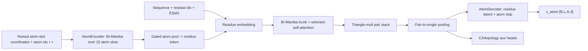

# Architecture

MambaFold is now a single-path direct all-atom flow-matching model.


```mermaid
flowchart LR
    A["Noised atom-slot coordinates + atom ids + t"] --> B["AtomEncoder: Bi-Mamba over 15 atom slots"]
    B --> C["Gated atom pool -> residue token"]
    D["Sequence + residue ids + ESM3"] --> E["Residue embedding"]
    C --> E
    E --> F["Bi-Mamba trunk + selected self-attention"]
    F --> G["Triangle-mult pair stack"]
    G --> H["Pair-to-single pooling"]
    H --> I["AtomDecoder: residue latent + atom skip"]
    I --> J["v_atom [B,L,A,3]"]
    H --> K["CA/topology aux heads"]
```

## Model

`src/mambafold/model/fold/all_atom.py::MambaFoldAllAtom`

- Input: sequence features, chain/entity/sym ids, ESM3, noised atom-slot coordinates, FM time.
- Output: `v_atom [B, L, A, 3]` and `v_ca` as the CA slot view.
- Atom path: `AtomEncoder` and `AtomDecoder` run Bi-Mamba over the 15 atom slots
  inside each residue; no atom attention.
- Trunk: Bi-Mamba with optional interleaved self-attention.
- Pair path: relative-position initialized pair tensor, PairBlock stack, pair-to-single pooling.
- Aux heads: distogram, contact, pseudo-CB direction, confidence.

## Loss

`src/mambafold/train/engine.py`

```text
L = L_fm_atom
  + alpha(t) * w_lddt_atom * L_lddt_atom_sampled
  + alpha(t) * w_lddt_ca   * L_lddt_ca
  + w_bond      * L_bond
  + w_clash     * L_all_atom_clash_sampled
  + w_ca_clash  * L_ca_clash
  + w_chirality * L_ca_trace_chirality
  + w_chirality_atom * L_ca_center_chirality
  + CA topology auxiliaries
```

All-atom LDDT and all-atom clash are sampled to keep L=1024 training feasible.
Confidence is supervised against sampled per-residue all-atom LDDT and is
written to inference PDB B-factors.
