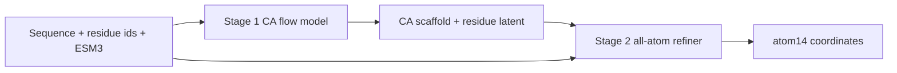

# Architecture

MambaFold is a single-chain coarse-to-fine structure generator.

## Overview


```mermaid
flowchart LR
    A[Sequence + residue ids + ESM3] --> B[Stage 1 CA flow model]
    B --> C[CA scaffold + residue latent]
    C --> D[Stage 2 all-atom refiner]
    A --> D
    D --> E[atom14 coordinates]
```

## Stage 1: C-alpha Scaffold

`src/mambafold/model/fold/stage1_ca.py::MambaFoldStage1`

Inputs:

- residue type and sequence position features
- chain/entity/sym ids retained for data compatibility, but training filters to single-chain
- FM time `t`
- noisy CA coordinates from `batch.x_t[..., CA_ATOM_ID, :]`
- optional ESM3 embedding

Outputs:

- `v_ca`: CA velocity, `[B, L, 3]`
- `trunk_latent`: residue latent passed to Stage 2
- optional `distogram_logits` for pair-stack supervision

Losses:

```text
L_stage1 = L_fm_ca + alpha(t) L_lddt_ca + w_bond L_ca_ca_bond + w_distogram L_distogram
```

## Stage 2: All-atom Refiner

`src/mambafold/model/fold/stage2_atom.py::MambaFoldStage2`

Inputs:

- full atom-slot noisy tensor
- Stage 1 CA scaffold
- Stage 1 residue latent
- atom/residue identity features
- FM time `t`

Stage 2 initializes the CA slot from Stage 1. It does not hard-pin CA: the velocity head may move CA locally, while `w_ca_anchor` penalizes drift from the Stage 1 scaffold.

Losses:

```text
L_stage2 = L_fm_non_ca + alpha(t) L_lddt_full + w_bond L_bond + w_clash L_clash + w_ca_anchor L_ca_anchor
```

Training can inject small noise into the Stage 1 CA condition:

```yaml
ca_condition_noise_std: 0.03
ca_condition_noise_prob: 0.5
```

This reduces the gap between perfect GT-like conditioning and predicted Stage 1 scaffolds.

## Wrapper

`src/mambafold/model/fold/two_stage.py::TwoStageMambaFold`

- Phase 2: `freeze_stage1=True`; Stage 1 runs under `no_grad`, Stage 2 trains.
- Joint: `freeze_stage1=False`; both stages train.
- Checkpoint state keys remain `stage1.*` and `stage2.*`.

## Configs

| Config | Stage |
|---|---|
| `configs/stage1.yaml` | Stage 1 pretraining, L=512 |
| `configs/stage1_ct.yaml` | Stage 1 continuation, L=1024 |
| `configs/stage2.yaml` | Stage 2 all-atom refinement |
| `configs/joint.yaml` | optional joint finetune |

## Code Map

```text
src/mambafold/model/fold/
├── stage1_ca.py
├── stage2_atom.py
├── two_stage.py
├── pair_blocks.py
├── linear_tri_attn.py
├── multiplicative_update.py
└── conditioning.py
```
