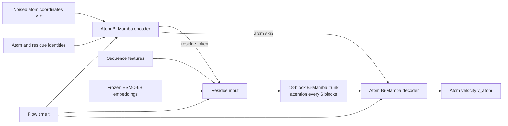

# Architecture

The active MambaFold-ESMC-6B checkpoint is a pair-free direct all-atom
flow-matching model. The atom decoder emits the velocity field; coordinates
flow into the model only through the noised atom state.


```mermaid
flowchart LR
    X["Noised atom coordinates x_t"] --> AE["Atom Bi-Mamba encoder"]
    I["Atom and residue identities"] --> AE
    T["Flow time t"] --> AE
    AE -->|"residue token"| R["Residue input"]
    S["Sequence features"] --> R
    P["Frozen ESMC-6B embeddings"] --> R
    T --> R
    R --> M["18-block Bi-Mamba trunk<br/>attention every 6 blocks"]
    M --> AD["Atom Bi-Mamba decoder"]
    AE -->|"atom skip"| AD
    T --> AD
    AD --> V["Atom velocity v_atom"]
```

## Active model contract

`src/mambafold/model/fold/all_atom.py::MambaFoldAllAtom`

- Inputs: noised atom-slot coordinates `x_t [B,L,A,3]`, atom/residue
  identities and masks, chain-local position features, flow time, and pinned
  ESMC-6B residue embeddings.
- Atom encoder: two bidirectional Mamba layers over the 15 atom slots inside
  each residue, followed by gated pooling to one residue token. It also keeps
  a per-atom skip representation.
- Residue trunk: 18 bidirectional Mamba blocks at width 1,024, with 16-head
  self-attention after every sixth block and time-conditioned AdaLN-Zero.
- Pair path: disabled (`use_pair_stack: false`, `n_pair_blocks: 0`). No
  quadratic pair representation participates in the active forward path.
- Atom decoder: two bidirectional Mamba layers conditioned on the residue
  latent, flow time, identities, and encoder atom skip. Its output is
  `v_atom [B,L,A,3]`; `v_ca` is the CA-slot view of that velocity.

The flow path is

```text
x_t = t x_clean + (1 - t) epsilon
v_target = x_clean - epsilon
v_theta = MambaFold(x_t, t, sequence, ESMC)
```

and training minimizes the masked atom-velocity error plus geometry and
structure auxiliaries. The active configuration samples the expensive
all-atom lDDT and clash terms so length-1,024 examples remain feasible.

The ESMC-6B conditioner is sequence-only and frozen. This avoids feeding
predicted structure tokens into the folding head, but it does not prove that a
benchmark sequence was absent from ESMC pretraining. Leakage claims therefore
apply only to the audited coordinate-training corpus.
