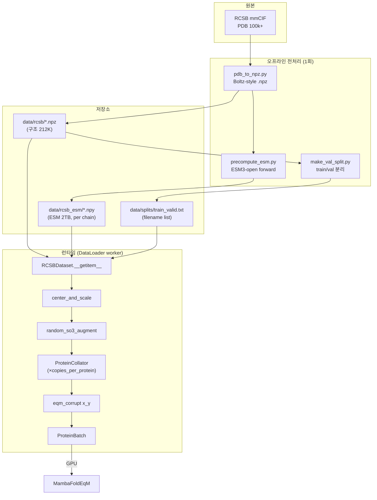
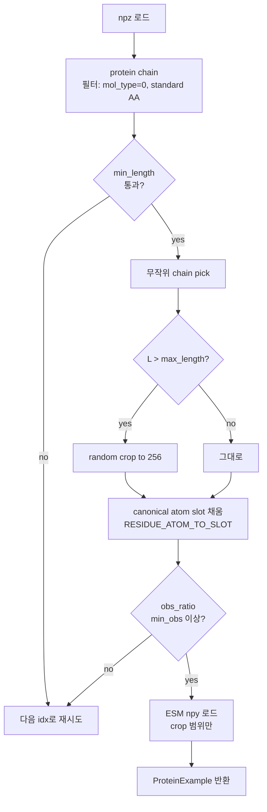
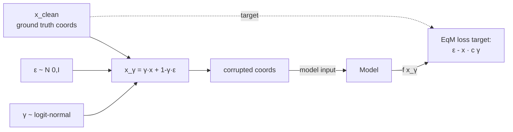
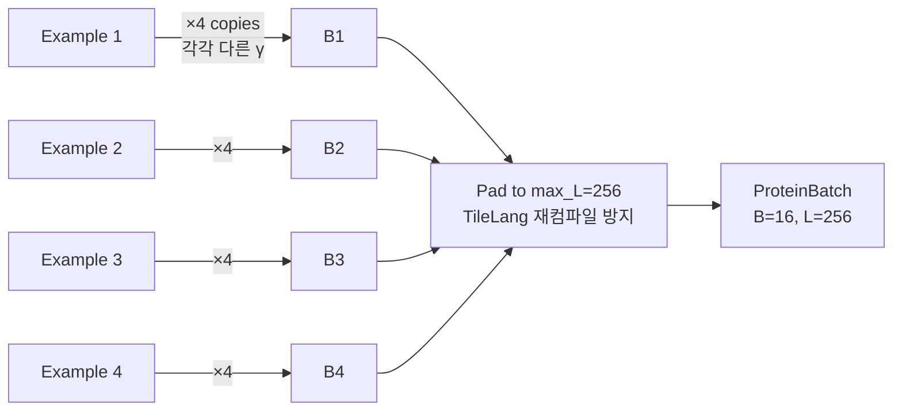

# 데이터 파이프라인

원본 PDB 구조 → 학습용 `ProteinBatch`까지 흐름.

## 전체 흐름



## 파일 포맷

### `.npz` (Boltz 구조 파일) — `data/rcsb/{pdb_id}.npz`

구조화된 numpy array 4개를 담은 compressed npz:

| 키 | dtype | 내용 |
|---|---|---|
| `residues` | structured (`name`, `res_type`, `res_idx`, `atom_idx`, `atom_num`, `is_standard`, ...) | residue 메타 |
| `atoms` | structured (`coords`, `is_present`, ...) | 모든 원자 좌표 + 관측 여부 |
| `chains` | structured (`name`, `mol_type`, `res_idx`, `res_num`, ...) | chain별 index 범위 |
| `mask` | bool | residue 유효 마스크 |

`src/mambafold/data/constants.py`의 `BOLTZ_*_DTYPE` 참고.

### `.npy` (ESM embedding) — `data/rcsb_esm/{pdb_id}_ch{j}.npy`

- per-protein-chain 파일: `{pdb_id}_ch0.npy`, `{pdb_id}_ch1.npy`, ...
- shape `[n_chain_residues, 1536]`, dtype `float32`
- **동일 시퀀스는 dedup**되어 한 번만 forward → 모든 매칭 파일에 같은 결과 복사

### `train_valid.txt` — `data/splits/`

```
101m.npz
102l.npz
...
(212387 줄)
```

## RCSBDataset (`src/mambafold/data/dataset.py`)

```python
class RCSBDataset(Dataset):
    def __init__(self, data_dir, max_length=512, min_length=20,
                 min_obs_ratio=0.5, file_list=None, esm_dir=None):
        # file_list 주면 해당 파일만, 없으면 data_dir 전체 rglob
```

`__getitem__` 흐름:



**Canonical atom slot**: residue마다 최대 15 원자 슬롯이 정해진 순서(`RESIDUE_ATOMS`)로 배치됨 — atom 14 + OXT.  
예: `ALA = [N, CA, C, O, CB]` (index 0~4), 나머지 슬롯은 atom_mask=False.

## 변환 (`transforms.py`)

### `center_and_scale(example)`

- 관측 heavy atom centroid로 평행이동
- `COORD_SCALE=10.0` 으로 나눔 (Å → normalized units)

### `random_so3_augment(example)`

- 임의 SO(3) 회전행렬 샘플링 → 모든 원자 좌표에 적용
- 구조적 invariance 학습 보조

### `eqm_corrupt(coords, atom_mask, schedule="logit_normal")`

EqM forward process:
```
x_γ = γ · x_clean + (1-γ) · ε
```
- `ε ~ N(0, I)` 원자별 독립 노이즈
- `γ ~ 0.98·LogitNormal(μ=0.8, σ=1.7) + 0.02·U(0, 1)` (SimpleFold 레시피)
- High γ (≥0.9) 샘플 쪽이 많이 뽑힘 → clean 근처 정밀 학습에 바이어스



## ProteinCollator (`collate.py`)

배치 구성:

```python
ProteinCollator(augment=True, copies_per_protein=4, gamma_schedule="logit_normal",
                max_length=256)
```

동일 단백질을 `copies_per_protein=4`회 복제하여 각각 다른 γ로 corrupt.



**Effective batch**: 4 (proteins) × 4 (copies) = 16 samples/GPU 
현재 1× H100 단일 GPU 학습 시 **16 samples/step, batch_size=8 명령줄 override 시 32 samples/step**.

### ProteinBatch 필드

| 필드 | shape | 설명 |
|---|---|---|
| `res_type` | B, L | AA index (0–20) |
| `res_seq_nums` | B, L | sequence position |
| `atom_type` | B, L, A | atom name index |
| `pair_type` | B, L, A | (residue, atom) pair ID |
| `res_mask` | B, L | valid residue |
| `atom_mask` | B, L, A | atom slot has canonical atom |
| `valid_mask` | B, L, A | atom_mask & observed |
| `ca_mask` | B, L | CA 관측 여부 |
| `x_clean` | B, L, A, 3 | GT coords (normalized) |
| `x_gamma` | B, L, A, 3 | noisy coords |
| `eps` | B, L, A, 3 | 원본 노이즈 |
| `gamma` | B, 1, 1, 1 | 노이즈 레벨 |
| `esm` | B, L, 1536 or None | ESM embedding |

## 오프라인 스크립트

### `precompute_esm.py`

```bash
PYTHONPATH=src .venv/bin/python scripts/precompute_esm.py \
    --data_dir data/rcsb \
    --out_dir data/rcsb_esm \
    --esm_model esm3-open
```

2-phase:
1. **Phase 1**: 모든 npz 스캔 → `seq → [output_path, ...]` 맵 (unique 시퀀스만 forward)
2. **Phase 2**: unique seq마다 ESM forward 1회 → 매칭 파일 전체에 저장

전체 212K chain에서 unique ~100K, H100 기준 ~4시간.

### `pdb_to_npz.py`

단일 PDB mmCIF → Boltz-style npz 변환. 수동 검증이나 특정 단백질 추가 시 사용.

## 데이터 규모

| 항목 | 크기 |
|---|---|
| `data/rcsb/*.npz` | ~50 GB (212K chains) |
| `data/rcsb_esm/*.npy` | **~2 TB** (unique seqs만 저장해도 많음) |
| `data/splits/train_valid.txt` | 4 MB |

→ **`.gitignore`에 `data/` 포함 필수** (2TB는 git 불가).
