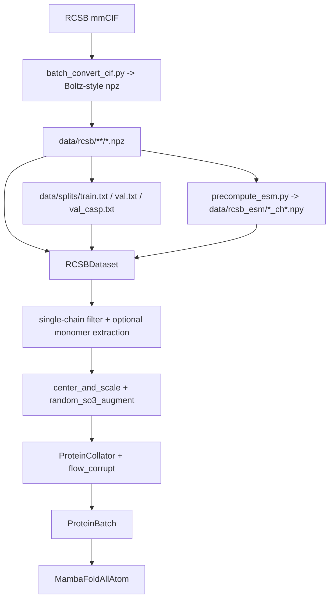

# Data Pipeline

Active path: `configs/direct_allatom_360m.yaml` with RCSB Boltz-style `.npz`
records and per-chain ESM3 `.npy` caches.

## Flow


```mermaid
flowchart TB
    R["RCSB mmCIF"] --> C["batch_convert_cif.py -> Boltz-style npz"]
    C --> N["data/rcsb/**/*.npz"]
    N --> S["data/splits/train.txt / val.txt / val_casp.txt"]
    N --> E["precompute_esm.py -> data/rcsb_esm/*_ch*.npy"]
    N & S & E --> D["RCSBDataset"]
    D --> X["single-chain filter + optional monomer extraction"]
    X --> T["center_and_scale + random_so3_augment"]
    T --> P["ProteinCollator + flow_corrupt"]
    P --> B["ProteinBatch"]
    B --> M["MambaFoldAllAtom"]
```

## Stored Files

| Path | Meaning |
|---|---|
| `data/rcsb/**/*.npz` | Boltz-style structure records |
| `data/rcsb_esm/*_ch*.npy` | per-original-chain ESM3 embeddings, shape `[L_chain, 1536]` |
| `data/splits/train.txt` | training file list |
| `data/splits/val.txt` | validation file list |
| `data/splits/val_casp.txt` | CASP-style holdout list |

## RCSBDataset

`RCSBDataset` loads protein chains, keeps standard amino acids, and flattens the
kept residues into one residue axis while preserving:

| Field | Meaning |
|---|---|
| `chain_id` | 0-based chain index in the loaded example |
| `entity_id` | shared id for chains with identical sequences |
| `sym_id` | copy number within an entity |
| `res_seq_nums` | residue index within the original chain |
| `is_nterm` / `is_cterm` | original-chain termini |

Active config uses both:

- `single_chain_only: true`
- `extract_monomer_chains: true`

So multimer records can contribute individual monomer chains, but the model
training target remains single-chain.

If `len(example) > max_length`, a random contiguous crop is used. Active
`max_length` is `1024`.

## ESM3 Loading

For each residue, the dataset looks up:

```text
data/rcsb_esm/<npz_stem>_ch<origin_chain>.npy
```

Rows are reassembled according to the crop and returned as `ProteinExample.esm`.
The loader verifies that `esm_dir` exists and contains `.npy` files. If
`use_plm=true`, missing batch ESM is a hard model error, so run
`scripts/precompute_esm.py` until it reports `0 files to write` before training.

Very long chains are limited to the residue range covered by their precomputed
ESM rows, so random training crops do not silently enter an unconditioned tail.

## Runtime Transforms

### `center_and_scale(example)`

Centers on the observed-atom centroid and divides by `COORD_SCALE=10.0`.

### `random_so3_augment(example)`

Applies one SO(3) rotation to every atom.

### `flow_corrupt(coords, atom_mask, schedule)`

```text
x_t = t * x_clean + (1 - t) * eps
eps is centered over valid observed atoms
```

The function default is `uniform`; the active config passes
`t_schedule: logit_normal`, a SimpleFold-style schedule that oversamples
cleaner states near `t -> 1`.

## ProteinBatch Fields

| Field | Shape | Description |
|---|---|---|
| `res_type` | `B, L` | amino-acid index |
| `res_seq_nums` | `B, L` | chain-local residue index |
| `atom_type` | `B, L, A` | atom name id |
| `pair_type` | `B, L, A` | residue-atom pair id |
| `res_mask` | `B, L` | valid residue mask |
| `atom_mask` | `B, L, A` | canonical atom exists |
| `valid_mask` | `B, L, A` | canonical and observed atom, loss only |
| `ca_mask` | `B, L` | observed C-alpha mask |
| `chain_id`, `entity_id`, `sym_id` | `B, L` | chain-aware features |
| `is_nterm`, `is_cterm` | `B, L` | original-chain terminus flags |
| `x_clean` | `B, L, A, 3` | normalized ground-truth coords |
| `x_t` | `B, L, A, 3` | corrupted coords |
| `eps` | `B, L, A, 3` | sampled noise |
| `t` | `B, 1, 1, 1` | interpolation time |
| `esm` | `B, L, 1536` or `None` | ESM3 conditioning |

## ESM Precompute

```bash
PYTHONPATH=src uv run python scripts/precompute_esm.py \
  --data_dir data/rcsb \
  --out_dir data/rcsb_esm
```

The script scans `.npz` files, deduplicates identical sequences, runs ESM once
per unique sequence, and writes per-chain `.npy` outputs.
