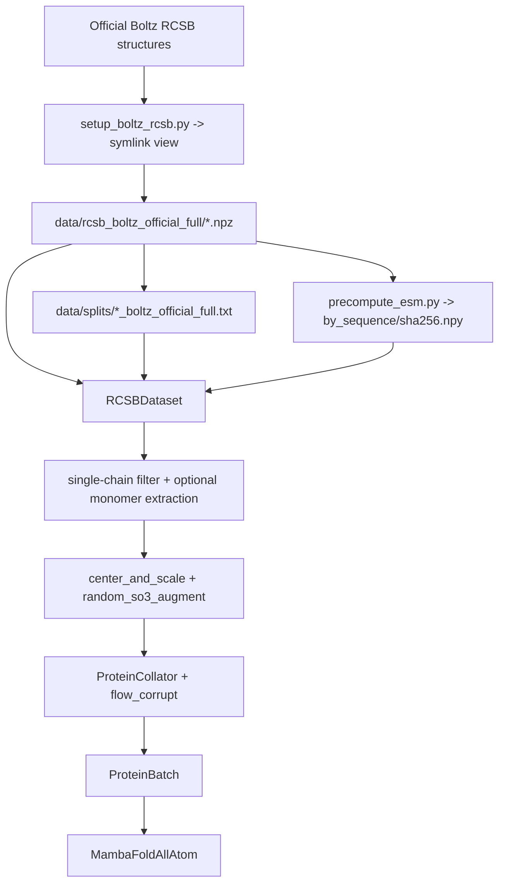

# Data Pipeline

Active path: `configs/direct_allatom_puremamba_attn6_geo_adaln_sf360_esmc6b.yaml`
with RCSB/AFDB Boltz-style `.npz` records and sequence-addressed ESMC-6B `.npy` caches.

## Flow


```mermaid
flowchart TB
    R["Official Boltz RCSB structures"] --> C["setup_boltz_rcsb.py -> symlink view"]
    C --> N["data/rcsb_boltz_official_full/*.npz"]
    N --> S["data/splits/*_boltz_official_full.txt"]
    N --> E["precompute_esm.py -> by_sequence/sha256.npy"]
    N & S & E --> D["RCSBDataset"]
    D --> X["single-chain filter + optional monomer extraction"]
    X --> T["center_and_scale + random_so3_augment"]
    T --> P["ProteinCollator + flow_corrupt"]
    P --> B["ProteinBatch"]
    B --> M["MambaFoldAllAtom"]
```

## Stored Files

| Path | Meaning |
|---|---|
| `data/rcsb_boltz_official_full/*.npz` | symlinks to the size- and pair-verified official Boltz RCSB records |
| `data/rcsb_esmc6b_official_full/by_sequence/<prefix>/<sha256>.npy` | one ESMC-6B embedding per full canonical sequence, shape `[min(L, 1024), 2560]` |
| `data/rcsb_esm_official_full/*_ch*.npy` | incomplete legacy occurrence-addressed ESM3 cache for prior checkpoints, shape `[L_chain, 1536]` |
| `data/splits/train_boltz_official_full.txt` | frozen-train intersection with full official Boltz data |
| `data/splits/val_boltz_official_full.txt` | frozen-validation intersection with full official Boltz data |
| `data/splits/val_casp_boltz_official_full.txt` | frozen CASP intersection with full official Boltz data |

Build the local view without copying structure data:

```bash
python scripts/setup_boltz_rcsb.py \
  --source-dir <full-official-boltz-structures> \
  --view-dir data/rcsb_boltz_official_full \
  --tag boltz_official_full
```

The former 67,657-record directory was a partial copy, not the complete
official archive. It is retained only as `data/rcsb_boltz_partial_67k/` and
must not be used for active training.

## External Distillation Data

SimpleFold public list files are stored under `data/external/simplefold/`.
They are source manifests, not active training data.

AFDB SwissProt import path:

```bash
PYTHONPATH=src uv run python scripts/download_afdb_simplefold.py \
  --id_list data/external/simplefold/swissprot_list.csv \
  --out_dir data/afdb_swissprot/npz \
  --cif_dir data/external/afdb_swissprot_cif \
  --manifest data/afdb_swissprot/manifest.tsv \
  --workers 8
```

The SimpleFold IDs are historical `model_v4` names. The importer resolves the
current AlphaFold DB CIF URL via API, converts to the same Boltz-style `.npz`
layout as `RCSBDataset`, and records the resolved model id/version in the
manifest. Do not merge this into `data/rcsb/`; keep split/leakage policy explicit
before training on mixed experimental and predicted structures.

## RCSBDataset

`RCSBDataset` loads protein chains, keeps standard amino acids, and flattens the
kept residues into one residue axis while preserving:

| Field | Meaning |
|---|---|
| `chain_id` | 0-based chain index in the loaded example |
| `entity_id` | shared id for chains with identical sequences |
| `sym_id` | copy number within an entity |
| `res_seq_nums` | residue index within the original chain |
| `is_nterm` / `is_cterm` | original-chain termini |

Active config uses both:

- `single_chain_only: true`
- `extract_monomer_chains: true`

So multimer records can contribute individual monomer chains, but the model
training target remains single-chain.

If `len(example) > max_length`, a random contiguous crop is used. Active
`max_length` is `1024`.

## PLM Loading

For each protein chain, the dataset reconstructs the full canonical sequence
and looks up:

```text
<configured esm_dir>/by_sequence/<sha256-prefix>/<sha256(full-sequence)>.npy
```

The legacy `<npz_stem>_ch<origin_chain>.npy` path remains a read fallback.

Rows are reassembled according to the crop and returned as `ProteinExample.esm`.
The loader verifies that `esm_dir` exists and contains `.npy` files. If
`use_plm=true`, missing batch ESM is a hard model error, so run
`scripts/precompute_esm.py` until it reports `0 files to write` before training.

Very long chains are limited to the residue range covered by their precomputed
ESM rows, so random training crops do not silently enter an unconditioned tail.

## Runtime Transforms

### `center_and_scale(example)`

Centers on the observed-atom centroid and divides by `COORD_SCALE=10.0`.

### `random_so3_augment(example)`

Applies one SO(3) rotation to every atom.

### `flow_corrupt(coords, atom_mask, schedule)`

```text
x_t = t * x_clean + (1 - t) * eps
eps is centered over valid observed atoms
```

The function default is `uniform`; the active config passes
`t_schedule: logit_normal`, a SimpleFold-style schedule that oversamples
cleaner states near `t -> 1`.

## ProteinBatch Fields

| Field | Shape | Description |
|---|---|---|
| `res_type` | `B, L` | amino-acid index |
| `res_seq_nums` | `B, L` | chain-local residue index |
| `atom_type` | `B, L, A` | atom name id |
| `pair_type` | `B, L, A` | residue-atom pair id |
| `res_mask` | `B, L` | valid residue mask |
| `atom_mask` | `B, L, A` | canonical atom exists |
| `valid_mask` | `B, L, A` | canonical and observed atom, loss only |
| `ca_mask` | `B, L` | observed C-alpha mask |
| `chain_id`, `entity_id`, `sym_id` | `B, L` | chain-aware features |
| `is_nterm`, `is_cterm` | `B, L` | original-chain terminus flags |
| `x_clean` | `B, L, A, 3` | normalized ground-truth coords |
| `x_t` | `B, L, A, 3` | corrupted coords |
| `eps` | `B, L, A, 3` | sampled noise |
| `t` | `B, 1, 1, 1` | interpolation time |
| `esm` | `B, L, d_plm` or `None` | frozen external PLM conditioning; active ESMC-6B uses `d_plm=2560` |

## ESM Precompute

```bash
DATA_DIR=data/rcsb_boltz_official_full \
OUT_DIR=data/rcsb_esmc6b_official_full \
sbatch scripts/slurm_precompute_esmc6b.sh
```

The script scans `.npz` files, globally shards full canonical sequences, runs
ESM once per unique sequence, and writes one content-addressed `.npy` output.
Repeated PDB/chain occurrences retain their coordinate examples but share the
same PLM array. `data/rcsb` is the alias created by `setup_boltz_rcsb.py` for
the official Boltz view.

To reuse a completed legacy occurrence cache without repeating ESM inference,
create a validated hard-link view:

```bash
sbatch --dependency=afterok:<precompute-job-id> \
  scripts/slurm_migrate_esmc6b_by_sequence.sh
```

For the monomer-only AFDB SwissProt set, reuse its generated FASTA to avoid
reopening every NPZ during indexing:

```bash
DATA_DIR=data/afdb_swissprot/npz \
OUT_DIR=data/afdb_swissprot_esmc6b \
SINGLE_CHAIN_FASTA=data/afdb_swissprot/sequences.fasta \
sbatch scripts/slurm_precompute_esmc6b.sh
```
