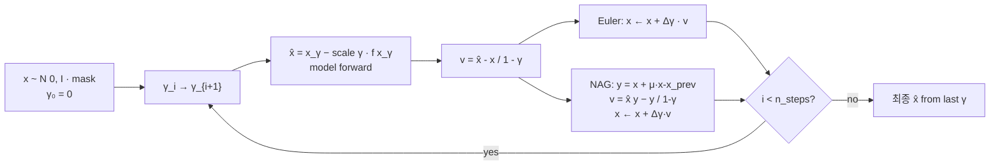
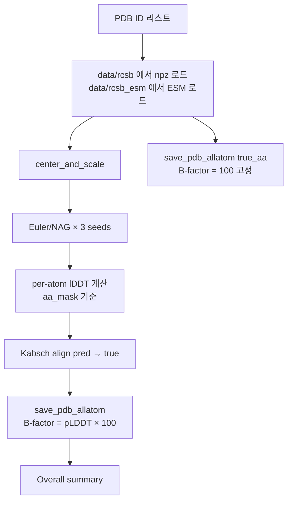
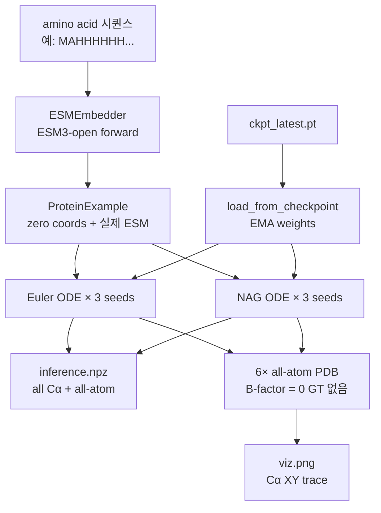
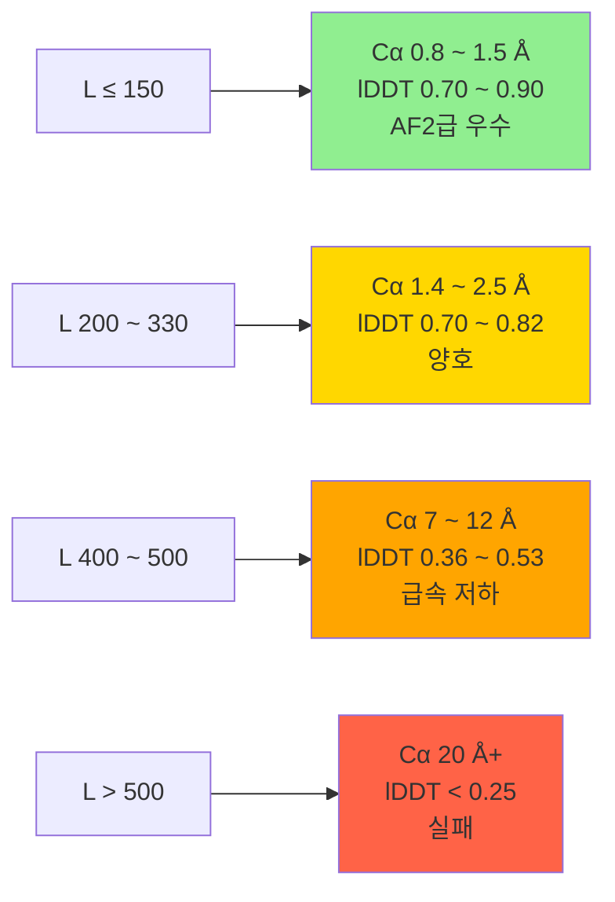

# 추론 파이프라인

학습된 체크포인트에서 단백질 구조 예측 + 평가.

## 스크립트 종류

| 스크립트 | 입력 | 출력 | 용도 |
|---|---|---|---|
| `scripts/infer_seq.py` | amino acid 시퀀스 | all-atom PDB | 임의 시퀀스 예측 (GT 없음) |
| `scripts/infer_train.py` | 학습 세트 PDB ID 리스트 | RMSD/lDDT + all-atom PDB + per-atom pLDDT | 학습 sanity check |
| `scripts/infer_2025.py` | PDB ID (2025+) | RMSD/lDDT + 다중 γ 분석 | 신규 구조 추론 |
| `scripts/precompute_esm.py` | npz 폴더 | `*.npy` ESM 캐시 | 대량 전처리 |

## 핵심 공유 함수 (`infer_train.py`에 정의, 다른 스크립트가 import)

### `sample_euler / sample_nag` — EqM ODE 샘플러



**Euler**: 단순 Probability Flow ODE 적분. 50 step.

**NAG (Nesterov)**: lookahead momentum (`μ=0.35`) 추가해 고진동 억제. EqM 논문 Form 1.

```python
@torch.no_grad()
def sample_euler(model, example, n_steps=50, seed=0, device="cuda"):
    x = torch.randn(L, A, 3) * mask
    sched = torch.linspace(0.0, 0.99, n_steps + 1)
    for i in range(n_steps):
        γ = sched[i].clamp(min=1e-4); Δγ = sched[i+1] - sched[i]
        x_hat = _x_hat(model, x, ex, γ, device)    # 모델 forward
        v = (x_hat - x) / (1 - γ)
        x = (x + Δγ * v) * mask
    return x_final_ca [L,3], x_final_aa [L,A,3], traj, sched
```

### `_x_hat` — 모델 forward + 단일 step clean 재구성

```python
with torch.amp.autocast("cuda", dtype=torch.bfloat16):
    pred = model(batch)
scale = eqm_reconstruction_scale(batch.gamma)
x_hat = (x - scale * pred)[0]
```

**중요**: `batch.esm` 필드에 **실제 ESM 임베딩**을 넣어야 함. `None`으로 넘기면 모델이 zero 벡터로 대체해 성능이 크게 저하됨.

초기 `infer_seq.py`/`export_inference.py`는 `esm=None`으로 호출했고, 이때문에 10AF 시퀀스 추론 시 RMSD 20Å가 나왔음.
→ `infer_train.py`의 `sample_euler/nag`는 `example.esm`이 있으면 자동으로 주입.

## 평가 메트릭

### Cα RMSD (Kabsch 정렬)

```python
from mambafold.utils.geometry import kabsch_rmsd
rmsd = kabsch_rmsd(pred_ca[mask], true_ca[mask])   # flat [N, 3]
```

### All-atom RMSD

```python
# flatten [L, A, 3] → [L*A, 3], mask [L, A] → [L*A]
kabsch_rmsd(pred_aa.reshape(-1, 3),
            true_aa.reshape(-1, 3),
            aa_mask.reshape(-1))
```

### Hard lDDT (Cα)

```python
def hard_lddt(p, t, mask, cutoff=15.0):
    dp = pairwise_dist(p[mask])
    dt = pairwise_dist(t[mask])
    diff = |dp - dt|
    return mean over thresholds ∈ {0.5, 1, 2, 4}: mean(diff < thr)
```

### Per-atom lDDT (B-factor용)

```python
def per_atom_lddt(pred_aa, true_aa, mask_la, cutoff=15.0):
    # atom i 주변 cutoff=15Å 이내 이웃에 대해
    # |d_pred(i,j) − d_true(i,j)| < thr 비율 평균
    return [L, A]  # 0~1 범위
```

→ PDB B-factor 컬럼에 `×100` 해서 기록 (**AlphaFold pLDDT 컨벤션**).

## infer_train.py — 학습 세트 sanity check



출력 파일 예시:
```
outputs/infer_train/26367_pdb_fixed/
├── 2olz_euler_seed0.pdb     # 예측 all-atom, B-factor=pLDDT
├── 2olz_euler_seed1.pdb
├── 2olz_euler_seed2.pdb
├── 2olz_nag_seed0.pdb
├── 2olz_nag_seed1.pdb
├── 2olz_nag_seed2.pdb
├── 2olz_true.pdb             # GT all-atom (B-factor=100)
├── ... (단백질별 반복)
└── infer_train.npz           # 모든 RMSD/lDDT 배열
```

### PyMOL 비교 예시

```pymol
load 1eid_true.pdb
load 1eid_euler_seed0.pdb
align 1eid_euler_seed0, 1eid_true
spectrum b, blue_white_red, 1eid_euler_seed0, 30, 95
```

- 파란색 = 낮은 pLDDT (불확실 영역)
- 빨간색 = 높은 pLDDT (확신 높음)

## infer_seq.py — 임의 시퀀스 예측



```bash
PYTHONPATH=src .venv/bin/python scripts/infer_seq.py \
    --ckpt outputs/train/26367/ckpt_latest.pt \
    --seq "MAHHHHHHMSRPHVFF..." \
    --pdb_id 10AF \
    --out outputs/infer_2025/10af \
    --n_seeds 3 --n_steps 50 --use_ema
```

GT 없으므로 B-factor는 0. seed 간 일관성(Rg, pairwise RMSD)으로 신뢰도 추정 가능.

## infer_2025.py — 최신 PDB 구조 벤치마크

1. RCSB에서 mmCIF 다운로드
2. Boltz-style npz 변환
3. 여러 γ에서 **single-step 재구성** (x̂ = x_γ − scale·f) RMSD/lDDT 평가
4. Euler/NAG ODE 샘플링 + 시각화

학습 세트에 없는 2025+ 공개 구조로 일반화 성능 측정 용도.

## 추론 시간 (A5000 기준)

50 step ODE (Euler 또는 NAG) 한 번 = 50회 forward pass.

| 단계 | 시간 | 비고 |
|---|---|---|
| ESM3-open embedding 계산 | ~15 s | 최초 1회 (모델 로드 + forward) |
| TileLang 커널 컴파일 | ~20–60 s | 최초 1회, 배치 shape별 캐시 |
| 모델 checkpoint 로드 | ~3 s | 2.8 GB ckpt, EMA 추출 |
| **단일 sample (50 step)** | **5–25 s** | L에 비례 |

### 전체 inference (3 seeds × Euler+NAG = 6 samples) — 측정값

| 단백질 | L | 총 시간 | 단일 sample 평균 |
|---|---|---|---|
| 9IQM | 131 | 1:52 | ~8 s |
| 10AF | 179 | 1:08 | ~5 s |
| 9KQV | 422 | 2:10 | ~12 s |
| 학습세트 8개 (L=30–1024) | — | 7:33 | ~9 s |

### 대략적 기준 (1 단백질, ckpt 로드 + 6 samples 기준)

| GPU | L<150 | L~200–400 | L~500–1000 |
|---|---|---|---|
| **A5000 24GB** | ~1–2 min | ~2–3 min | ~3–5 min |
| **H100 80GB** | ~30–60 s (추정) | ~1–2 min | ~2–3 min |

TileLang 첫 컴파일 후에는 반복 시퀀스 여러개를 연속으로 돌릴수록 overhead가 분산되어 **평균 단일 sample ~5–10s**로 수렴.

## 검증된 결과 (step 450k, ckpt_26367, EMA, ESM3-open 적용)

### 학습 세트 (8 개, 3 seeds × Euler+NAG)

| PDB | L | Cα RMSD (best seed) | All-atom RMSD | Cα-lDDT |
|---|---|---|---|---|
| 2olz | 30 | 4.13 | 4.87 | 0.70 |
| 1eid | 124 | **0.98** | **1.46** | **0.86** |
| 5lfl | 202 | 1.85 | 2.33 | 0.75 |
| 7uvm | 221 | 1.42 | 1.98 | 0.82 |
| 8ki5 | 332 | 2.21 | 2.77 | 0.70 |
| 1h6b | 433 | 7.85 | 7.61 | 0.53 |
| 7l7s | 524 | 11.26 | 11.45 | 0.36 |
| 7n4x | 1024 | 22.52 | 22.68 | 0.22 |

**Overall (Euler)**: Cα=6.5 Å, AA=6.9 Å, lDDT=0.62

Euler vs NAG 차이 <1% — 두 방법 사실상 동일한 결과.

### 신규 시퀀스 (학습 세트 밖)

| PDB | L | crystal L | Cα RMSD (best) | Cα-lDDT | 비고 |
|---|---|---|---|---|---|
| 10AF | 179 | 170 (core) | **0.81** | **0.89** | cyclophilin A 변이체, AF2급 |
| 9IQM | 131 | 121 | 2.52 | 0.66 | 대략 fold 맞음 |
| 9KQV | 423 | 366 (×2 chain) | 24.8 | 0.13 | 학습 crop 범위 밖 |

### 길이 vs 성능 관계



**경계선 L ≈ 256** (학습 crop 크기와 일치) — finetune(crop=512)으로 극복해야 함.

### 10AF 사례 분석 — 신규 시퀀스도 AF2급 가능

MAHHHHHHM (His-tag) 포함 전체 RMSD 계산 시:
- seed 간 RMSD ~20 Å (tag 9 aa가 flexible하게 돌아다녀서)
- 단순 지표만 보면 "망가졌다"고 오해

tag 제외 core 170 aa만 (crystal 10AF와 직접 비교):
- **Cα RMSD 0.81 Å, lDDT 0.89**
- seed 간 0.81 Å (일관성도 완벽)
- 모델 자체는 AF2급 성능

→ 평가 시 **unobserved/flexible 영역 마스킹**이 매우 중요.

### ESM 유무에 따른 성능 차이 (10AF 기준)

| 조건 | seed 간 RMSD | Rg 범위 | crystal 대비 RMSD |
|---|---|---|---|
| ESM=0 벡터 (구 스크립트) | 20.95 Å | 15.2–26.6 Å | N/A (망가짐) |
| **ESM3-open 실제 값** | **0.81 Å** | 14.3–15.4 Å (일관) | **0.81 Å** |

학습 조건(`use_plm=True`)과 일치시키는 게 필수.

## 주의사항

### ESM은 반드시 실제 값 사용

- 모델은 `use_plm=True`로 학습됨
- `batch.esm = None` → zero 벡터로 대체 → 결과 크게 저하
- `infer_train.py`/`infer_seq.py` 모두 이 부분 수정됨 (이전 `infer_2025.py` 포함 일부 스크립트는 여전히 zero ESM 쓸 수 있음)

### Multi-chain npz의 chain 선택

`RCSBDataset.__getitem__`에서 chain을 **무작위** 선택 (`torch.randint`). 재현성 필요 시 seed 고정.

### seed 간 RMSD vs 단일 예측 RMSD

tag나 flexible loop가 있는 구조는 seed 간 RMSD가 크게 나와 "모델이 혼란"처럼 보이지만, 실제 GT 대비 RMSD는 낮을 수 있음. 평가는 **crystal 대비 RMSD**를 기준으로.

예시 (10AF):
- MAHHHHHHM N-term tag 포함 RMSD: 4.0 Å (seed 간)
- tag 제외 core 170 aa: **0.81 Å** (vs crystal), seed 간도 0.81 Å
- tag 9 aa만: 7.7 Å (예상대로 disordered)
