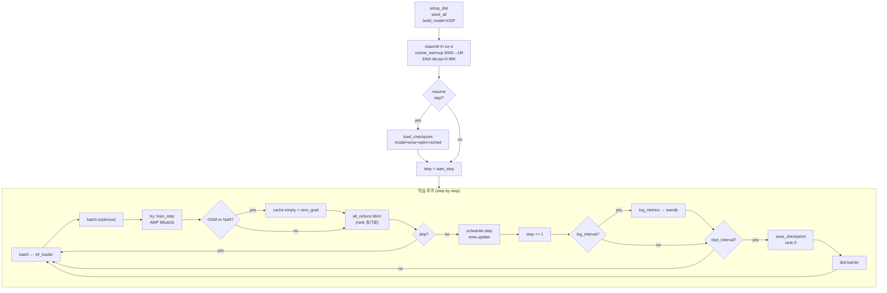

# 학습 파이프라인

`scripts/train.py` · `src/mambafold/train/*`.

## EqM (Equilibrium Matching) 목적함수

**핵심 아이디어**: noise schedule 없이 clean structure의 **gradient field** 직접 학습.

### Forward process (데이터 corruption)

```
x_γ = γ · x_clean + (1-γ) · ε,   ε ~ N(0, I),   γ ~ logit-normal
```

### 모델이 예측하는 것

모델 `f(x_γ, γ)`은 다음을 맞춤:

```
f(x_γ) ≈ (ε − x_clean) · c(γ)
```

여기서 `c(γ)`는 truncated c (SimpleFold/EqM 관례):

```
c_trunc(γ) = 1                    if γ ≤ a=0.8
           = (1-γ) / (1-a)        if γ > a
c(γ) = λ · c_trunc(γ),  λ=4.0
```

### Loss (`losses/eqm.py`)

```python
target = (eps - x_clean) * c(γ)           # [B, L, A, 3]
L_EqM = ||pred - target||² (masked mean over valid atoms)
```

### Reconstruction

추론 시 clean 구조 재구성:

```
x̂ = x_γ − scale(γ) · f(x_γ)
scale(γ) = (1-γ)/λ        if γ ≤ a
         = (1-a)/λ         if γ > a
```

## Loss 구성

총 loss = EqM + α · LDDT

```python
# train/engine.py
loss_eqm = eqm_loss(pred, x_clean, eps, gamma, valid_mask, a=0.8, lam=4.0)

# soft-lDDT: 재구성된 구조 x̂와 clean의 Cα 거리 일치도
scale = eqm_reconstruction_scale(gamma)
x_hat = batch.x_gamma - scale * pred
loss_lddt = soft_lddt_ca_loss(x_hat, x_clean, ca_mask, cutoff=1.5)

# Pretrain: α=1 constant
# Finetune: α = (1 + 8·ReLU(γ - 0.5)).mean() — clean 근처에서 lDDT 강조
loss = loss_eqm + alpha * loss_lddt
```

## 학습 루프



## 하이퍼파라미터 (`configs/pretrain_256.yaml`)

```yaml
total_steps:    1_000_000
lr:             1.0e-4      # SimpleFold: AdamW 1e-4
warmup_steps:   5_000       # linear warmup
grad_clip:      1.0
ema_decay:      0.999
gamma_schedule: logit_normal  # 0.98·LN(0.8, 1.7) + 0.02·U(0,1)
ckpt_interval:  10_000
batch_size:     8           # per-GPU protein count
copies_per_protein: 4       # 같은 단백질 다른 γ
max_length:     256         # pretrain crop (finetune 단계에선 512)
```

**Effective batch** (1× H100):
- 8 proteins × 4 copies = **32 samples/step**

LR schedule:
```
step ∈ [0, 5000]:    lr = step/5000 * peak_lr     (linear warmup)
step ∈ [5000, 1M]:   lr = peak_lr * 0.5*(1 + cos(π * progress))
```

## DDP 특성 (`distributed.py`)

```python
def setup_dist():
    dist.init_process_group("nccl", timeout=timedelta(minutes=30))
    return True, rank, world_size, f"cuda:{local_rank}"
```

- NCCL backend, timeout 30분
- validation/checkpoint 저장은 rank 0만 → 다른 rank는 `dist.barrier()`로 대기

### Multi-GPU OOM hang 방지

초기에 4× RTX 6000 Ada로 DDP 학습 시 **NCCL ALLREDUCE hang** 발생:
- 한 rank가 긴 시퀀스로 OOM → hang
- 다른 rank들이 30분 gradient sync 대기 후 timeout → SIGABRT
- 해결: `scripts/train.py` 학습 루프에 **OOM catch + all-rank sync**

```python
oom = False
try:
    metrics = train_step(model, batch, optimizer, ...)
except torch.cuda.OutOfMemoryError:
    oom = True
    torch.cuda.empty_cache()
    optimizer.zero_grad(set_to_none=True)

# NaN loss도 같은 경로
if not oom and not np.isfinite(metrics["loss"]):
    oom = True
    optimizer.zero_grad(set_to_none=True)

# 모든 rank에 skip 여부 동기화
if is_dist:
    skip_t = torch.tensor([1 if oom else 0], device=device)
    dist.all_reduce(skip_t, op=dist.ReduceOp.MAX)
    oom = skip_t.item() > 0

if oom:
    continue   # 해당 배치만 skip, 다음 배치 계속
```

→ 그래도 forward/backward 내부 임의 hang은 잡을 수 없어, **단일 H100**으로 전환 후 안정화.

## SLURM 설정

### `scripts/slurm/train_h100.sh` (현재 사용)

```bash
#SBATCH --partition=heavy
#SBATCH --gres=gpu:h100:1
#SBATCH --mem=96G

RESUME=outputs/train/26367/ckpt_latest.pt \
.venv/bin/python -u scripts/train.py \
    --config configs/pretrain_256.yaml \
    --batch_size 8 \
    --out_dir outputs/train/${SLURM_JOB_ID} \
    ${RESUME:+--resume $RESUME}
```

- 단일 GPU → DDP/NCCL 이슈 원천 차단
- H100 80GB VRAM → batch 8 사용 시 ~60 GB

### `scripts/slurm/train.sh` (구버전 multi-GPU)

```bash
#SBATCH --partition=6000ada
#SBATCH --gres=gpu:4
# NCCL tuning
export NCCL_P2P_DISABLE=1
export NCCL_IB_DISABLE=1
export NCCL_SOCKET_IFNAME=lo
export NCCL_TIMEOUT=1800000    # 30분

torchrun --nproc_per_node=4 scripts/train.py ...
```

현재 H100 단일 GPU가 더 안정적.

## Checkpoint 포맷

```python
# trainer.py::save_checkpoint
torch.save({
    "step": step,
    "model": raw_model.state_dict(),
    "ema": ema.state_dict(),
    "optimizer": optimizer.state_dict(),
    "scheduler": scheduler.state_dict(),
    "args": vars(args),
    "wandb_run_id": wandb.run.id,
}, f"ckpt_{step:07d}.pt")
```

- 10,000 step마다 `ckpt_0010000.pt` 저장
- `ckpt_latest.pt` symlink 자동 갱신
- 파일 크기 ~2.8 GB per checkpoint

## 진행 기록 (2026-04 기준)

| Step | 체크포인트 | Loss | lDDT loss | 비고 |
|---|---|---|---|---|
| 50 | 23846 | 101 | 0.60 | 초기 |
| 88k | 23846 | 4.0 | 0.37 | 급강하 |
| 342k | 24012 | 2.9 | 0.35 | plateau 시작 |
| 406k | 24409 | 2.7 | 0.34 | 정체 |
| 459k | 26367 | 2.6 | 0.34 | 최저 (crash 직전) |
| 451k (현재) | 29229 H100 | 3.0 | 0.34 | batch 8 재시작 |

**Plateau 관측**: 250k 이후 loss 3.0 근처에서 정체. crop=256 한계로 추정 → finetune(crop=512)로 전환 권장.
